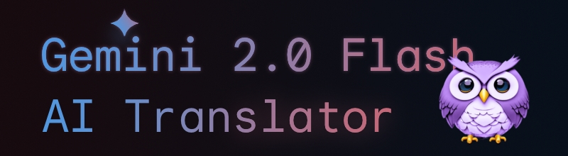
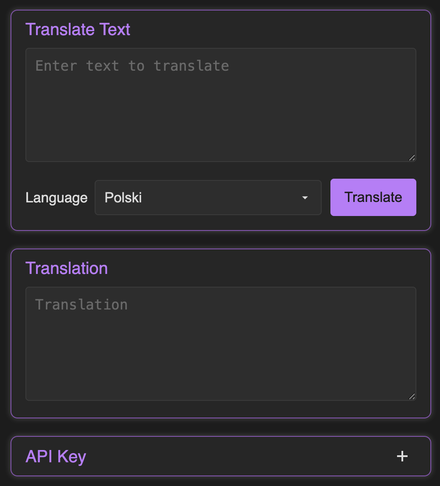
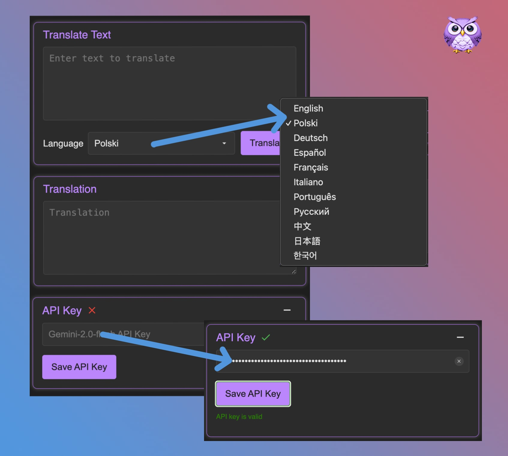

# 🌐 AI Translator Gemini API



A powerful Chrome extension that leverages Google's Gemini AI to provide instant translation, text correction, and image prompt enhancement directly in your browser. With support for 12 languages and multiple AI-powered modes, it's your ultimate multilingual companion.

## ✨ Key Features

### 🔄 **Dual Translation System**
- **Popup Translator**: Full-featured translation interface with history and settings
- **Selected Text Translation**: Instant translation of selected text on any webpage
- **Independent Language Settings**: Separate language preferences for each translation mode
- **Smart Context Detection**: Automatically detects input fields vs. webpage content

### 🌍 **Multilingual Support**
- **13 Languages**: English, Polish, German, Spanish, French, Italian, Portuguese, Russian, Japanese, Korean, Chinese, Vietnamese, Ukrainian
- **Complete UI Localization**: Interface adapts to your browser's language
- **Intelligent Language Mapping**: Automatic conversion between language codes and full names

### 🚀 **Advanced Features**
- **Multiple API Key Management**: Store and manage multiple Gemini API keys with health monitoring
- **Translation History**: Track and restore previous translations with smart filtering
- **One-Click Web Translation**: Select text on any webpage for instant floating translation
- **Screenshot Translation**: Capture and translate text from images (Ctrl+Shift+T)
- **Responsive Design**: Optimized interface with smooth animations
- **Offline Storage**: Secure local storage of settings and history
- **Copy to Clipboard**: One-click copying of translated text
- **Error Recovery**: Automatic retry with fallback API keys

## ⚙️ Installation

### From Chrome Web Store (Recommended)
*Coming soon - Extension is currently in review process*

### Manual Installation (Developer Mode)
1. **Download**: Clone or download this repository
   ```bash
   git clone https://github.com/yourusername/ai-translator-gemini-api.git
   ```
2. **Open Chrome Extensions**: Navigate to `chrome://extensions/`
3. **Enable Developer Mode**: Toggle the switch in the top right corner
4. **Load Extension**: Click "Load unpacked" and select the extension directory
5. **Pin Extension**: Click the puzzle icon and pin AI Translator for easy access

## 🚀 Quick Start Guide

### 1. **🔑 API Key Setup**
- Click the extension icon in your browser toolbar
- Navigate to **Settings** section
- Enter your [Google Gemini API key](https://aistudio.google.com/app/apikey)
- Click **"Save API Key"**
- ✅ **Free API keys available** - No credit card required for basic usage

### 2. **🎯 Configure Translation Settings**
Set up your translation preferences:
- **Popup Translator Language**: Choose target language for in-extension translations
- **Selected Text Language**: Set separate language for webpage text selection
- **Independent Settings**: Each translation mode has its own language preference

### 3. **💬 Start Using**

#### **In-Extension Translation**
1. Paste or type text in the input area
2. Select target language from dropdown
3. Click "Translate" button
4. Copy results with one click
5. View translation history in sidebar

#### **Web Page Translation**
1. Select any text on any webpage
2. Click the floating translate icon that appears
3. View instant translation in popup dialog
4. Translation uses your selected text language setting
5. Results automatically saved to history

#### **Screenshot Translation** (New!)
1. Press **Ctrl+Shift+T** to enter screenshot mode
2. Drag to select area containing text
3. AI will extract and translate all visible text
4. Perfect for images, PDFs, and non-selectable content

#### **History Management**
- View all previous translations in the sidebar
- Click any history item to restore both original and translated text
- Select multiple items for batch deletion
- Separate history for popup and selected text translations

## 📸 Screenshots & Demo

### Main Interface

*Modern, intuitive interface with multiple AI modes and translation history*

### Features Overview

*Complete feature overview showing all capabilities*

### Web Translation in Action

*One-click translation directly on any webpage*

## 🛠️ Technical Specifications

### **System Requirements**
- **Browser**: Chrome 88+ or Chromium-based browsers
- **API**: Google Gemini API key (free tier available)
- **Permissions**: Active tab access for web translation
- **Storage**: ~5MB for extension and user data

### **Supported Languages**
| Language | Code | Native Name |
|----------|------|-------------|
| English | en | English |
| Polish | pl | Polski |
| German | de | Deutsch |
| Spanish | es | Español |
| French | fr | Français |
| Italian | it | Italiano |
| Portuguese | pt | Português |
| Russian | ru | Русский |
| Japanese | ja | 日本語 |
| Korean | ko | 한국어 |
| Chinese | zh | 中文 |
| Vietnamese | vi | Tiếng Việt |

## 🔒 Privacy & Security

### **Data Protection**
- ✅ **Local Storage Only**: All data stored locally in your browser
- ✅ **No Data Collection**: We don't collect or store your personal data
- ✅ **Secure API Calls**: All requests use HTTPS encryption
- ✅ **No Third-Party Sharing**: Your API keys and translations stay private

### **Permissions Explained**
- **Active Tab**: Required for webpage text selection and translation
- **Storage**: Saves your settings, API keys, and translation history locally
- **Host Permissions**: Needed to inject translation interface on websites

### **API Key Security**
- Stored encrypted in Chrome's secure storage
- Never transmitted except to Google's Gemini API
- Can be easily removed or replaced
- Multiple key management for redundancy

## 📜 License

This project is licensed under the [MIT License](LICENSE).

## 🤝 Contributing

Contributions are welcome! Please feel free to submit a pull request.

## 🚀 Development & Contributing

### **Getting Started**
```bash
# Clone the repository
git clone https://github.com/yourusername/ai-translator-gemini-api.git
cd ai-translator-gemini-api

# Load in Chrome for development
# 1. Open chrome://extensions/
# 2. Enable Developer mode
# 3. Click "Load unpacked" and select the project folder
```

### **Project Structure**
```
ai-translator-gemini-api/
├── manifest.json          # Extension configuration
├── popup/                 # Main interface
│   ├── popup.html        # UI structure
│   ├── popup.css         # Styling
│   └── popup.js          # Main logic
├── background/           # Service worker
│   ├── background.js     # Background processes
│   └── config.js         # Configuration
├── content/              # Web page integration
│   ├── content.js        # Content script
│   └── content.css       # Injection styles
├── _locales/            # Internationalization
│   ├── en/messages.json  # English translations
│   ├── pl/messages.json  # Polish translations
│   └── ...              # Other languages
└── icons/               # Extension icons
```

### **Contributing Guidelines**
1. **Fork** the repository
2. **Create** a feature branch (`git checkout -b feature/amazing-feature`)
3. **Commit** your changes (`git commit -m 'Add amazing feature'`)
4. **Push** to the branch (`git push origin feature/amazing-feature`)
5. **Open** a Pull Request

### **Adding New Languages**
1. Create new folder in `_locales/` (e.g., `_locales/fr/`)
2. Copy `_locales/en/messages.json` to the new folder
3. Translate all message values
4. Test the extension with the new language

## 🐛 Troubleshooting

### **Common Issues**

#### **API Key Problems**
- ❌ **"Invalid API Key"**: Verify your key at [Google AI Studio](https://aistudio.google.com/app/apikey)
- ❌ **"API Key Empty"**: Make sure to paste the complete key
- ❌ **"Rate Limited"**: You've exceeded the free tier limits

#### **Translation Issues**
- ❌ **No translation appears**: Check your internet connection
- ❌ **Text not selectable**: Try refreshing the webpage
- ❌ **Extension not working**: Reload the extension in `chrome://extensions/`

#### **Interface Problems**
- ❌ **UI in wrong language**: Check your browser's language settings
- ❌ **History not saving**: Ensure Chrome has storage permissions
- ❌ **Popup not opening**: Try pinning the extension to toolbar

### **Getting Help**
- 📖 **Documentation**: Check this README for detailed instructions
- 🐛 **Bug Reports**: [Open an issue](https://github.com/yourusername/ai-translator-gemini-api/issues)
- 💡 **Feature Requests**: [Start a discussion](https://github.com/yourusername/ai-translator-gemini-api/discussions)
- 📧 **Contact**: [your-email@example.com](mailto:your-email@example.com)

## 📊 Stats & Recognition

- 🌟 **GitHub Stars**: Growing community of users
- 🔄 **Active Development**: Regular updates and improvements
- 🌍 **Global Reach**: Supporting 12+ languages
- 🚀 **Performance**: Optimized for speed and efficiency

## 📝 Changelog

### v2.1.0 (Latest) - Dual Translation System & Major Fixes
- **🔄 Independent Translation Modes**: Separated popup translator and selected text translation with independent language settings
- **🎯 Enhanced Selected Text Translation**: Fixed translation functionality - now properly translates instead of copying original text
- **🌐 Improved Language Handling**: Better language code mapping and API prompt optimization for more accurate translations
- **�️ API Response Processing**: Enhanced response parsing to handle various Gemini API output formats
- **🔧 Bug Fixes**: Resolved syntax errors and improved error handling throughout the extension
- **⚡ Performance Optimization**: Removed debug logging for faster execution and cleaner console output
- **🔒 Security Updates**: Updated host permissions for better API compatibility
- **📱 UI Improvements**: Better icon positioning and dialog box display for selected text translations

### v2.0.0 - Major UI Overhaul
- **🎨 New Design**: Complete interface redesign with modern styling
- **🔄 Multiple Modes**: Added Text Correction and Image Prompt Enhancement
- **📱 Responsive UI**: Improved layout with better proportions
- **📚 Enhanced History**: Fixed height, better scrolling, and improved management
- **🎯 Custom Dropdown**: Replaced select with custom dropdown for mode selection
- **⚡ Performance**: Faster textarea transitions and smoother animations
- **🌐 Complete Localization**: All 12 languages fully supported in new interface

### v1.4.0 - Internationalization
- **🌍 Multi-language Support**: Added 12 language translations
- **🔧 UI Localization**: Complete interface translation system
- **🔒 Enhanced Security**: Strict Content Security Policy implementation
- **🏗️ Architecture**: Restructured for Chrome Web Store standards
- **⚡ Optimization**: Improved background service worker performance

### v1.3.0 - Code Quality
- **🧹 Code Cleanup**: Dependency optimization and refactoring
- **🛡️ Error Handling**: Enhanced error management mechanisms
- **📝 HTML Improvements**: Semantic HTML structure updates
- **🎨 CSS Optimization**: Animation consolidation and performance
- **⚠️ Bug Fixes**: Status display and warning resolution

### v1.2.0 - User Experience
- **🎯 Language Selection**: Separate source/target language controls
- **🎨 UI Consistency**: Visual improvements across interface
- **📋 Copy Feedback**: Enhanced clipboard operation feedback
- **⚙️ Configuration**: Centralized text and settings management
- **🔑 API Validation**: Improved key format validation

### v1.1.0 - Foundation
- **📡 API Integration**: Translation request optimization
- **⚙️ Configuration**: Added centralized config system
- **🏷️ CSS Prefixing**: Namespace collision prevention

### v1.0.0 - Initial Release
- **🚀 Core Features**: Basic translation functionality
- **🔑 API Key Management**: Secure storage system
- **🌐 Web Integration**: Text selection translation
- **💾 Local Storage**: Settings and history persistence
