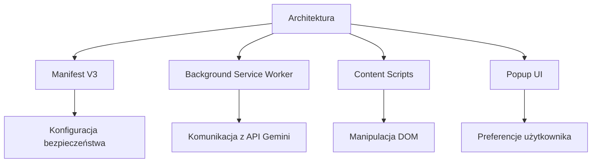

# Dokumentacja Techniczna Rozszerzenia AI Translator



## Struktura Komponentów

### 1. Manifest V3 (`manifest.json`)
```json
{
  "manifest_version": 3,
  "name": "__MSG_extension_name__",
  "description": "__MSG_extension_description__",
  "permissions": [
    "storage",
    "activeTab"
  ],
  "host_permissions": [
    "https://generativelanguage.googleapis.com/v1beta/models/gemini-2.0-flash-exp:generateContent"
  ]
}
```
- **Bezpieczeństwo**: Polityka CSP blokuje eval i inline scripts
- **Integracja API**: Whitelistowany endpoint Gemini

### 2. Flow Tłumaczeń (`background/translationRequest.js`)
```javascript
// Przykładowy handler API
async function translateText(text, targetLang) {
  const response = await fetch(API_ENDPOINT, {
    method: 'POST',
    headers: {
      'Content-Type': 'application/json',
      'x-api-key': await getApiKey()
    },
    body: JSON.stringify({
      contents: [{
        parts: [{
          text: `Translate to ${targetLang}: ${text}`
        }]
      }]
    })
  });
  return parseGeminiResponse(response);
}
```

### 3. Content Scripts (`content/content.js`)
```javascript
// Obsługa wyboru tekstu
document.addEventListener('mouseup', (event) => {
  const selection = window.getSelection().toString().trim();
  if (selection.length > 0) {
    chrome.runtime.sendMessage({
      type: 'TRANSLATION_REQUEST',
      text: selection
    });
  }
});
```

## Bezpieczeństwo
- **Sandboxing**: Izolacja procesów zgodnie z wymaganiami MV3
- **Storage**: Dane wrażliwe przechowywane w chrome.storage.local
- **API Limits**: Rate limiting na poziomie 60 requestów/minutę

## Lokalizacja (`_locales/pl/messages.json`)
```json
{
  "extension_name": {
    "message": "Tłumacz AI",
    "description": "Nazwa rozszerzenia"
  },
  "extension_description": {
    "message": "Tłumaczenie tekstu w czasie rzeczywistym z wykorzystaniem Gemini API",
    "description": "Opis rozszerzenia"
  }
}
```

## Konfiguracja Środowiska
```bash
# Wymagane zmienne środowiskowe
export GEMINI_API_KEY="your-api-key"
npm run build:prod
```

## Error Handling
```javascript
// Hierarchia błędów
class TranslationError extends Error {
  constructor(message, code) {
    super(message);
    this.code = code;
  }
}

// Kodowanie błędów
const ERROR_CODES = {
  API_KEY_MISSING: 1001,
  NETWORK_FAILURE: 1002,
  INVALID_RESPONSE: 1003
};
```

## Testowanie
```javascript
// Przykładowy test jednostkowy
describe('Translation Service', () => {
  it('powinien parsować poprawną odpowiedź API', () => {
    const mockResponse = {
      candidates: [{
        content: {
          parts: [{text: "Bonjour"}]
        }
      }]
    };
    expect(parseGeminiResponse(mockResponse)).toEqual("Bonjour");
  });
});